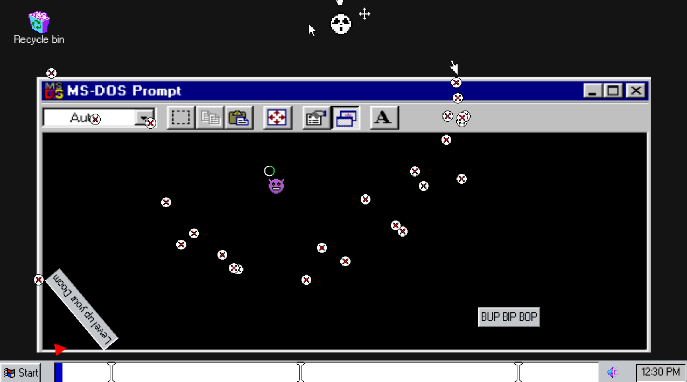
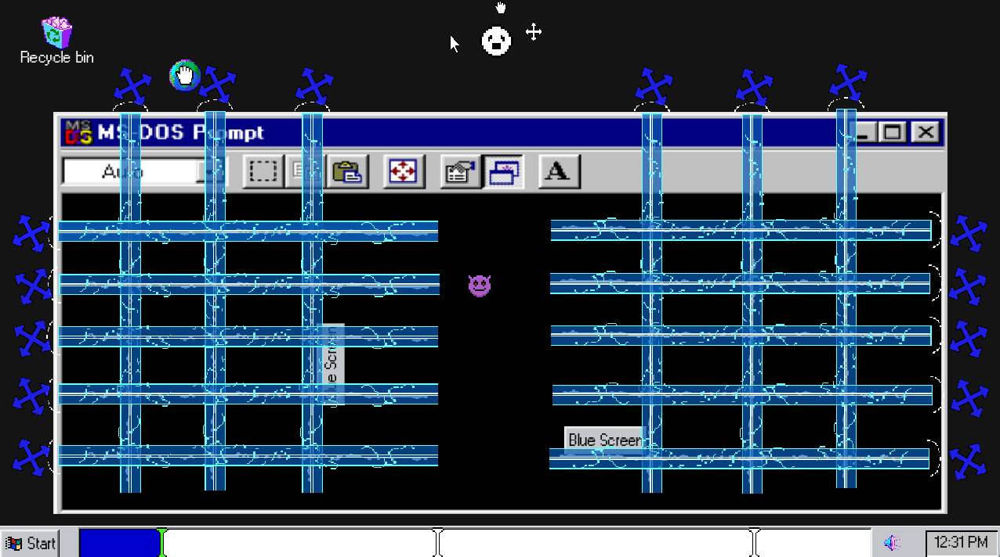
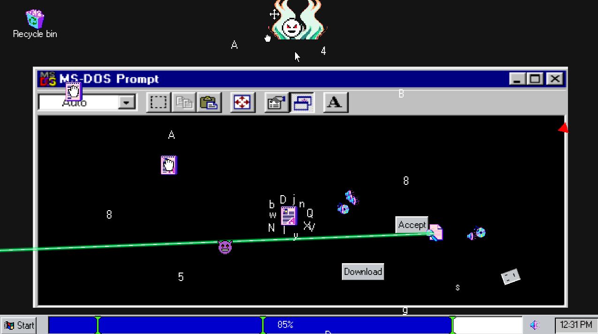
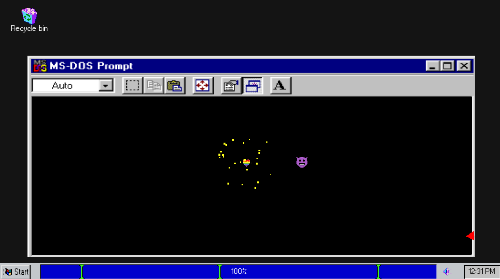
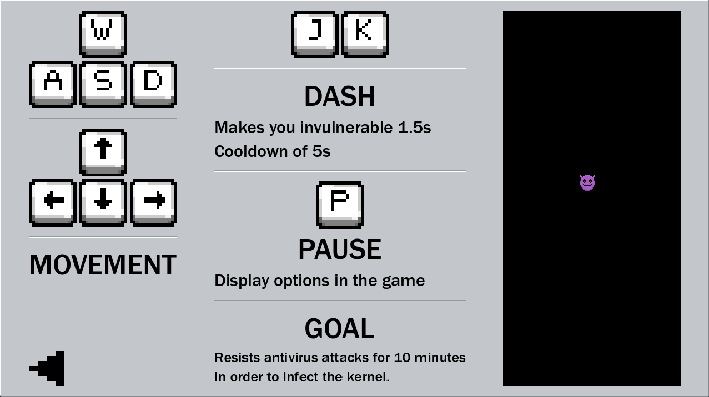

	

	

**IMPORTANT:**

* The **Mac version is not yet available**. I'm working on it to ensure a pleasant experience, as Apple systems have stricter requirements.
* The **web version has some sound issues and graphical glitches**. I recommend playing the **downloadable executables** for a smoother experience.

- - -

**Experience the exhilarating tension of a rogue virus in the first iteration of Kernel Panic!** Brace yourself for a bullet-hell barrage as you fight for digital dominance in a 10-minute battle against the antivirus protecting your target system.

**Sharpen your digital claws with:**

* **Minimalist movement, maximum challenge:** Navigate the battlefield with razor-sharp precision, dodging relentless waves of attacks in a dance of pure skill and focus.
* **Difficulty that grows with you:** As you progress, the antivirus adapts, forcing you to refine your tactics and master the art of digital warfare.
* **Pure, unadulterated fun:** This bite-sized experience packs a punch of exhilarating action and strategic depth, leaving you wanting more.
* **Regular updates and bug fixes:** I'm committed to keeping your experience smooth and polished, so don't hesitate to report any issues through the comments or directly to my [itch.io](https://bananaholograma.itch.io/kernelpanic) profile.

**Remember, you are the virus. Infect or be deleted. The clock is ticking. Are you ready?**

- - -

